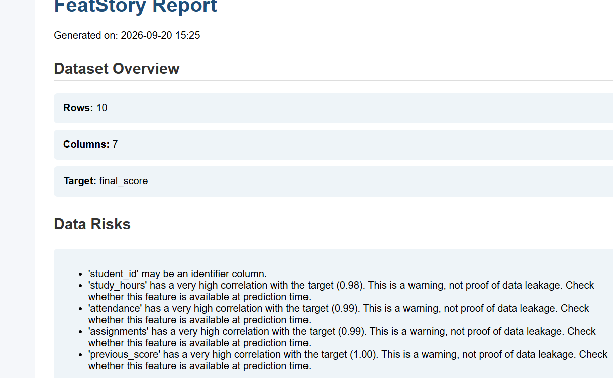

# FeatStory

### Don't just know which features matter. Understand why.
## 📊 Example Report



FeatStory is a Python data science library designed to help users understand the relationships between dataset features and a target variable.

Instead of only producing statistical values, FeatStory turns analysis into simple **feature stories**, identifies possible data risks, analyzes categorical features, calculates model-based feature importance, provides SHAP explanations, and generates an HTML report.

## ✨ Features

* 📊 Dataset profiling
* 🔎 Missing-value detection
* 🔎 Duplicate-row detection
* 🔎 Constant-column detection
* 🆔 Possible ID-column detection
* 📈 Feature-target correlation analysis
* 📝 Simple feature stories
* 🏷️ Categorical feature analysis
* ⚠️ Data-risk warnings
* 🌲 Random Forest feature importance
* 🔬 SHAP-based model explanation
* 📉 Correlation visualization
* 📄 Automatic HTML report generation
* 🧪 Automated tests with pytest

## 🚀 Quick Start

### 1. Clone the repository

```bash
git clone https://github.com/Anuj979304/FeatStory.git
cd FeatStory
```

### 2. Create a virtual environment

```bash
python -m venv .venv
```

Activate it on Windows:

```powershell
.venv\Scripts\Activate.ps1
```

### 3. Install dependencies

```bash
pip install pandas numpy matplotlib scikit-learn shap pytest
```

### 4. Analyze a dataset

```python
from featstory import Story

story = Story(
    "student_data.csv",
    target="final_score"
)

print(story.summary())

print(story.profile())

print(story.analyze())

print(story.detect_risks())

print(story.model_importance())

story.visualize()

story.explain_model()

story.generate_report()
```

## 📚 What FeatStory Analyzes

FeatStory can work with datasets containing numerical and categorical features.

For example:

```text
student_id
gender
study_hours
attendance
assignments
previous_score
final_score
```

It can analyze relationships such as:

```text
study_hours → final_score
attendance → final_score
previous_score → final_score
```

For categorical variables, it can compare target values across different categories.

## ⚠️ Data Risk Detection

FeatStory can identify potential issues such as:

* Missing values
* Duplicate rows
* Possible identifier columns
* High-cardinality categorical columns
* Very high feature-target correlations

High correlation is treated as a **warning**, not automatic proof of data leakage. Users should check whether a feature would actually be available at prediction time.

## 🤖 Model Explainability

FeatStory uses a Random Forest model to estimate feature importance.

It also supports **SHAP-based explanations** to help understand how features contribute to model predictions.

## 📄 HTML Reports

FeatStory can automatically generate an HTML report containing:

* Dataset overview
* Data risks
* Categorical feature analysis
* Feature stories
* Feature correlations
* Model feature importance
* Visualizations

Example:

```python
story.generate_report()
```

This creates:

```text
featstory_report.html
```

## 🧪 Testing

Run the automated tests with:

```bash
python -m pytest
```

Current test suite:

```text
5 passed
```

## 📁 Project Structure

```text
FeatStory/
│
├── featstory/
│   ├── __init__.py
│   ├── story.py
│   ├── profiler.py
│   ├── analyzer.py
│   ├── visualizer.py
│   ├── model.py
│   ├── risk.py
│   ├── xai.py
│   └── report.py
│
├── examples/
│   ├── __init__.py
│   ├── test_story.py
│   └── student_data.csv
│
├── tests/
│   └── test_featstory.py
│
├── README.md
└── .gitignore
```

## 🛠️ Technologies

* Python
* Pandas
* NumPy
* Matplotlib
* Scikit-learn
* SHAP
* Pytest

## 🎯 Project Goal

FeatStory aims to make data science analysis easier to understand by connecting statistical relationships, model importance, explainability, and data-quality warnings in one workflow.

The project is especially useful for learning and demonstrating practical data science concepts.

## 🔮 Future Improvements

Planned improvements include:

* Better handling of classification datasets
* More statistical tests
* Additional feature-relationship visualizations
* Improved report customization
* More model types
* Better XAI support
* Package installation through PyPI
* Expanded test coverage

## 📌 Project Status

FeatStory is currently under active development.

Built as a learning-focused data science project combining **Python, statistics, machine learning, data analysis, and explainable AI**.
